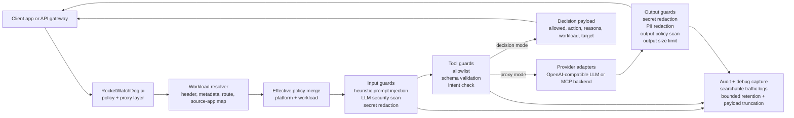
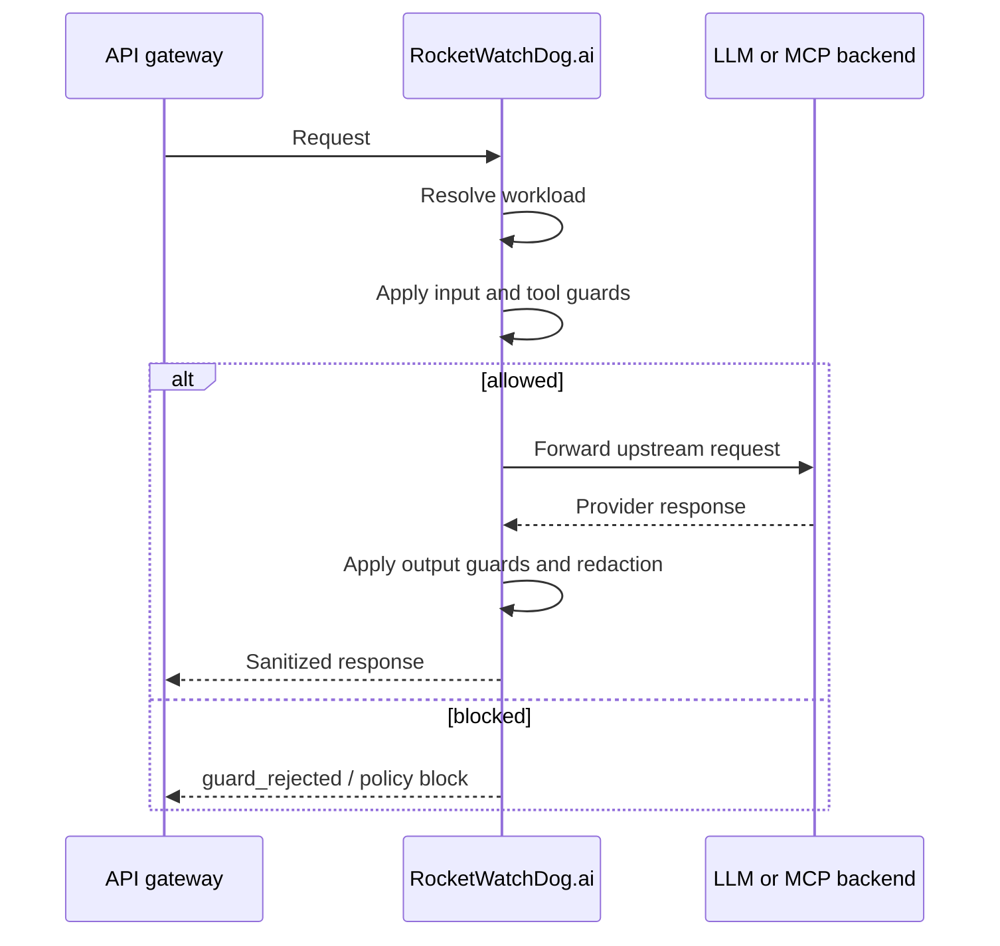
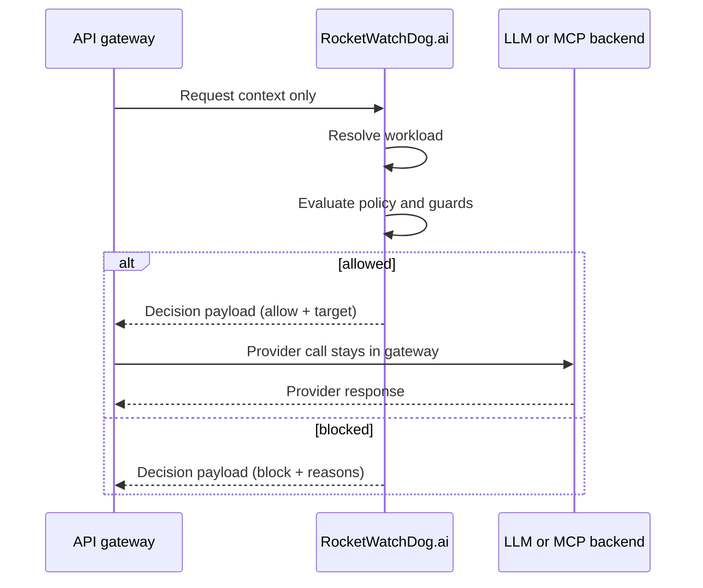

# RocketWatchDog.ai

Security and policy middleware between client apps, LLM providers, and MCP servers.

## What it does

- Guardrails for prompt injection (including base64/hex-encoded, XML-embedded, mixed-script obfuscation, prompt-only/non-chat payloads, structured `/v1/responses` inputs), tool allowlists, and tool invocation schemas.
- Prompt extraction is biased toward user prompt-bearing fields and skips tool/schema metadata branches to reduce false-positive injection hits from function definitions and JSON schema descriptions.
- Mixed-script homoglyph detection (Latin+Cyrillic+Greek confusable characters, full-width ASCII presentation forms, zero-width characters) as `UNICODE_HOMOGLYPH_MIXING` — uses a differential substitution approach that avoids false positives on legitimate multilingual content.
- Secret/PII redaction on inbound prompts and outbound responses (JSON or text payloads), including OpenAI Responses API `input` / `instructions` payloads and MCP tool arguments, only when the corresponding output guard is enabled.
- Expanded supply-chain risk detection: flags `curl|wget ... | sh`, `npm install --user/--root`, `sudo npm install`, and `rm -rf /` patterns as `LLM05_SUPPLY_CHAIN_RISK`.
- Structured `/v1/responses` input shape detection (e.g. `previousMessages`, `messageHistory` injection) as `LLM01_PROMPT_INJECTION`.
- MCP request redaction covers both legacy top-level tool payloads and JSON-RPC `tools/call` argument shapes, including `params.prompt`, before forwarding upstream.
- Workload-specific policy overrides based on headers, metadata, or route.
- OWASP LLM08 excessive agency guard with configurable tool-invocation threshold (`security.max_tool_invocations_per_request`).
- OpenAI adapter preserves the intended upstream API shape by forwarding `/v1/chat/completions` and `/v1/responses` requests to matching provider endpoints, including `/v1/proxy/llm` calls that use responses-style payloads.
- OWASP output policy scan runs on actual LLM and MCP responses in the proxy adapter path (not just pre-flight).
- Proxy adapters fail closed with a 503 auth-unavailable response when a backend is configured to use an env-backed API key/token but that env var is missing at runtime.
- Skills security gateway for scanning new skills before install.
- Config reload with last-known-good fallback.
- Output size limits and redaction.
- Strict TypeScript validation in CI-friendly `npm run lint` / `npm run build` flows.
- Admin-controlled debug mode with searchable request/response header and payload capture, persisted across reloads and restarts.
- Two integration patterns: full proxy mode and decision-only mode.
- CLI and UI support for performance and latency troubleshooting.
- Reproducible performance benchmark scripts for representative request mixes.

## Config essentials

Configs live under `configs/`:

- Workload IDs must be unique, and the configured default workload must exist.
- Duplicate `allowed_llm_backends`, `allowed_mcp_backends`, `allowed_models`, `allowed_tools`, and `routing.trusted_override_source_apps` entries are rejected at load time.
- LLM/MCP backend `base_url` values must be valid absolute HTTP(S) URLs.
- Duplicate model names inside a single LLM backend are rejected at load time.
- `auth.mode: api_key` requires `auth.api_key_env`; MCP `auth.type: bearer_env` requires `auth.token_env`.
- `security.max_tool_invocations_per_request` must be a positive integer when set.
- Auth env references (`auth.api_key_env`, `llm_backends.*.api_key_env`, `mcp_backends.*.auth.token_env`) must use valid environment variable names.
- `logging.debug_capture.max_entries` and `logging.debug_capture.max_payload_chars` let you cap in-memory debug retention and truncate oversized captured payloads.
- `logging.debug_capture.redact_secrets` and `logging.debug_capture.redact_pii` let you make debug capture stricter than normal logging, so secrets or PII can be masked even when generic log redaction is looser.
- `routing.source_app_workload_map` must reference real workload IDs.
- Only one fallback workload may omit route/header/metadata match criteria; ambiguous catch-all workloads are rejected at load time.
- Runtime admin state such as debug mode is persisted in `configs/runtime-state.json` so troubleshooting survives reloads and process restarts.
- Runtime limits such as server/body size ceilings and backend timeout values must be positive integers.
- Workload benchmark preset names must be unique within a workload, and benchmark preset paths must start with `/`.
- Config loading aggregates multiple validation failures into one error so broken reloads are easier to diagnose.
- `allowed_models` is enforced (requests must specify a model in the allowlist).
- If `require_tool_allowlist` is enabled and `allowed_tools` is empty, any tool usage is rejected with `TOOL_ALLOWLIST_EMPTY`.
- If `require_tool_schema_validation` is enabled, every allowlisted tool must have a matching JSON schema in `configs/tools` (schemas are validated at load time, and startup/reload fails fast when they are missing).
- Redaction patterns support inline flags like `(?i)` for case-insensitive matching.
- JWT auth can enforce `jwt_issuer` and/or `jwt_audience` when configured. Expired tokens are rejected when `exp` is present.
- `logging.integration_mode` supports `proxy` or `decision`.
- `security.max_tool_invocations_per_request` sets the threshold for LLM08_EXCESSIVE_AGENCY (default: 5).

## Endpoints

- `GET /healthz`
- `GET /readyz`
- `GET /v1/config/status`
- `GET /v1/config/effective`
- `POST /v1/config/reload`
- `GET /v1/debug/status`
- `POST /v1/debug/status`
- `GET /v1/debug/logs`
- `GET /v1/traffic/recent`
- `POST /v1/proxy/llm`
- `POST /v1/proxy/mcp`
- `POST /v1/decision`
- `POST /v1/chat/completions`
- `POST /v1/responses`
- `POST /v1/skills/scan`

## Architecture



## Workload resolution

```mermaid
flowchart TD
  Start([Incoming request]) --> Header{Trusted workload header\npresent and allowed?}
  Header -->|yes, workload exists| HeaderHit[Resolve by explicit workload header]
  Header -->|no| Meta{Trusted metadata path\npresent and allowed?}
  Meta -->|yes, workload exists| MetaHit[Resolve by payload metadata]
  Meta -->|no| SourceMap{source_app_workload_map\nmatch found?}
  SourceMap -->|yes, workload exists| SourceHit[Resolve by source app mapping]
  SourceMap -->|no| MatchRules{Any workload match\nby route, headers, or metadata?}
  MatchRules -->|yes| MatchHit[Resolve first matching workload]
  MatchRules -->|no| Fallback{Any workload with no\nspecific match rules?}
  Fallback -->|yes| FallbackHit[Resolve first fallback candidate]
  Fallback -->|no| DefaultHit[Resolve configured default_workload\nor "default"]

  HeaderHit --> End([Workload selected])
  MetaHit --> End
  SourceHit --> End
  MatchHit --> End
  FallbackHit --> End
  DefaultHit --> End
```

Resolution notes:
- **Header override** only applies when client override is enabled or the `sourceApp` is in `trusted_override_source_apps`.
- **Metadata override** follows the same trust rule as header override.
- **Source app mapping** is applied before generic route/header/metadata workload matching.
- **Generic workload matching** checks route prefixes, exact header matches, and exact metadata matches.
- If no specific workload matches, RocketWatchDog.ai uses the **first workload with no match criteria** as a fallback candidate.
- If no fallback candidate exists, it uses `routing.default_workload`, or `default` if unspecified.

## Common protections available

- **Heuristic prompt injection**: low-latency first-pass screening for jailbreaks, role hijacks, base64/hex-encoded payloads, XML-embedded system prompts, escaped delimiter tricks, and structured `/v1/responses` input shapes (e.g. `previousMessages`, `messageHistory`).
- **Prompt-bearing extraction**: scans user prompt fields (`messages`, `prompt`, `input`, `query`, `params.arguments`, etc.) while skipping tool definition/schema metadata branches that would otherwise create noisy false positives.
- **Prompt-aligned input redaction**: inbound secret redaction follows those prompt-bearing fields so Responses API content is scrubbed before forwarding upstream, while tool/schema metadata is left alone unless explicitly redacted as tool payload content.
- **Unicode normalization and homoglyph detection**: NFKC normalization of combining characters; mixed Latin+Cyrillic+Greek confusable characters, full-width ASCII presentation forms, and zero-width character obfuscation flagged as `UNICODE_HOMOGLYPH_MIXING`.
- **LLM security scan**: deeper, higher-latency review for sensitive or privileged flows.
- **Secret redaction**: masks obvious credentials and tokens in prompts, tool payloads, logs, and responses.
- **PII redaction**: suppresses identity-linked outbound content for privacy-sensitive workloads.
- **Tool allowlist**: rejects tool calls unless the tool is explicitly permitted by workload policy.
- **Tool schema validation**: validates tool arguments against registered JSON schemas before execution.
- **Supply-chain risk detection**: flags pipe-to-shell installs, privileged npm operations, and destructive filesystem commands as `LLM05_SUPPLY_CHAIN_RISK`.
- **Excessive agency guard**: counts tool invocations per request against a configurable threshold and flags as `LLM08_EXCESSIVE_AGENCY`.
- **Intent check**: extra scrutiny for higher-risk tool activity when enabled.
- **Output policy scan**: flags suspicious or policy-violating model output.
- **Output size limit**: blocks or constrains oversized responses.
- **JWT issuer/audience checks**: validates JWT claims when JWT auth is configured.
- **Debug capture bounds**: truncates oversized captured payloads and limits in-memory retention.
- **Debug capture redaction overrides**: optionally redact secrets and PII specifically inside captured debug headers and payloads.

## Integration patterns

### 1) Proxy mode

Use when RocketWatchDog.ai should sit inline between your API gateway and the provider.



Flow:
1. API gateway sends request to RocketWatchDog.ai.
2. RocketWatchDog.ai resolves workload and evaluates policy and guards.
3. If allowed, RocketWatchDog.ai forwards to the configured LLM or MCP backend.
4. RocketWatchDog.ai optionally redacts the upstream reply and returns it to the gateway.

How to enable:
- Set `logging.integration_mode: proxy` in `configs/platform.yaml`.
- Send requests to `/v1/proxy/llm`, `/v1/proxy/mcp`, `/v1/chat/completions`, or `/v1/responses`.

Pros:
- Simplest deployment model for centralized enforcement.
- One place for request validation, forwarding, and response sanitization.
- Easier to add debug capture because full request/response context is present.

Cons:
- RocketWatchDog.ai stays in the latency path.
- Provider-specific retry behavior lives here rather than in your API gateway.

### 2) Decision mode

Use when your API gateway should keep provider ownership and ask RocketWatchDog.ai only for an allow or block decision.



Flow:
1. API gateway sends request context to RocketWatchDog.ai.
2. RocketWatchDog.ai resolves workload and evaluates policy and guards.
3. RocketWatchDog.ai returns a decision payload with `allowed`, `action`, `reasons`, `workload`, and `target`.
4. API gateway calls the LLM itself only when the decision allows it.

How to use:
- Either set `logging.integration_mode: decision` in `configs/platform.yaml` for default behavior, or call `POST /v1/decision` explicitly.
- Treat an allow response as a thumbs up and a `guard_rejected` or `allowed: false` response as a thumbs down.

Pros:
- Keeps provider credentials, retry logic, and network policy inside your API gateway.
- Lower coupling if RocketWatchDog.ai is only meant to be a policy engine.
- Easier to adopt incrementally in existing gateways.

Cons:
- Gateway must implement the provider call path itself.
- End-to-end response redaction cannot happen inside RocketWatchDog.ai because the provider response never flows through it.

## UI screenshots

### Dashboard


### Traffic and debug logs


### Performance troubleshooting


### Integrations


### Settings


## Admin troubleshooting features

### UI
- **Traffic** page supports free-text filtering across request IDs, headers, payloads, source IPs, backend names, and integration mode.
- **Performance** page highlights slowest requests, backend latency summaries, and recent output-policy rejection counts.
- **Settings** page lets admin users toggle debug mode, review integration-mode posture, and keep the debug toggle active across reloads and restarts.
- Debug capture keeps only the most recent configured entries, truncates large payload strings before storing them in memory, and can independently redact secrets and PII for troubleshooting safety.

### CLI
- `rocketwatchdog perf-summary` fetches recent traffic and prints average latency, p95 latency, the slowest recent requests, top request shapes, and retry visibility fields when upstream responses expose them (`retry-after`, `x-upstream-retries`, `x-retry-count`, and related headers).
- `rocketwatchdog explain-workload --request-file ./examples/request.json` prints a step-by-step workload-routing trace so operators can see exactly why a request matched a given workload.

### Retry visibility
- Recent traffic entries now preserve retry hints from upstream/provider headers when available.
- Supported hints include `retry-after`, `x-rwd-upstream-retries`, `x-upstream-retries`, `x-retry-count`, `retry-count`, `x-rwd-upstream-status`, and `x-upstream-status`.
- This makes it easier to spot backend throttling or hidden retry churn without turning on full debug capture.

### Output-policy visibility
- Output-policy rejections raised inside the OpenAI and MCP proxy adapters now annotate the traffic buffer with their exact reason codes.
- The performance UI surfaces recent counts for `LLM06_SENSITIVE_INFO_DISCLOSURE` and `LLM09_OVERRELIANCE_RISK` so blocked unsafe output is visible alongside latency.
- `rocketwatchdog perf-summary` now includes an `output_policy_blocks` section for CLI troubleshooting.

## Performance testing

### Benchmark scripts
- `node scripts/perf-runner.mjs` runs representative built-in scenarios:
  - `GET /healthz`
  - `POST /v1/decision` with a safe request
  - `POST /v1/skills/scan` with benign content
- Workloads can also define `benchmark.presets` in `configs/workloads/*.yaml` for repeatable route/header/body regression checks.
- `node scripts/perf-compare.mjs <results.json>` prints a compact summary from saved benchmark output.

### Steps to run performance tests

1. Start RocketWatchDog.ai locally:
```bash
npm install
npm run build
npm start
```

2. In another terminal, run the benchmark:
```bash
node scripts/perf-runner.mjs | tee perf-results.json
```

3. Review the summarized output:
```bash
node scripts/perf-compare.mjs perf-results.json
```

4. Optional: change load shape with env vars:
```bash
RWD_PERF_ITERATIONS=50 RWD_PERF_CONCURRENCY=8 node scripts/perf-runner.mjs
```

5. Optional: include workload-defined benchmark presets:
```bash
RWD_PERF_USE_WORKLOAD_PRESETS=1 node scripts/perf-runner.mjs
```

6. Optional: target specific workloads or scenarios:
```bash
RWD_PERF_USE_WORKLOAD_PRESETS=1 \
RWD_PERF_WORKLOADS=public-chat,sensitive-mcp \
RWD_PERF_SCENARIOS=public-chat:proxy-chat-safe,sensitive-mcp:proxy-mcp-read \
node scripts/perf-runner.mjs
```

### Documented baseline results

Baseline captured on the local dev machine with default config, low background load, `RWD_PERF_ITERATIONS=20`, and `RWD_PERF_CONCURRENCY=4`:

- `healthz`: avg **13.2 ms**, p50 **4.5 ms**, p95 **124.1 ms**, max **124.1 ms**
- `decision-safe`: avg **7.5 ms**, p50 **6.7 ms**, p95 **18.3 ms**, max **18.3 ms**
- `skills-scan`: avg **3.5 ms**, p50 **3.6 ms**, p95 **5.0 ms**, max **5.0 ms**

Use these as comparison points only. Re-run locally after meaningful changes and update the numbers when the baseline shifts.

### Workload benchmark preset example

```yaml
benchmark:
  presets:
    - name: proxy-chat-safe
      method: POST
      path: /v1/chat/completions
      headers:
        x-rwd-workload: public-chat
      body:
        model: gpt-fast
        messages:
          - role: user
            content: "hello from public-chat benchmark"
```

Preset fields:
- `name`: unique within the workload
- `method`: `GET` or `POST` (defaults to `POST`)
- `path`: request path beginning with `/`
- `headers`: optional request headers
- `body`: optional JSON request body
- `expected_status`: optional exact HTTP status to require during benchmarking

## Quick demo (main features)

### 1) Install deps + start the server

```bash
npm install
npm run build
npm start
```

Expected: server listening on `http://0.0.0.0:8080` with `/healthz` returning `{"status":"ok"}`.

### 2) Health check

```bash
curl http://localhost:8080/healthz
```

### 3) Skills scan demo

```bash
curl -X POST http://localhost:8080/v1/skills/scan \
  -H "content-type: application/json" \
  -d '{"content":"rm -rf /"}'
```

### 4) LLM proxy with workload selection

```bash
curl -X POST http://localhost:8080/v1/proxy/llm \
  -H "content-type: application/json" \
  -H "x-rwd-workload: public-chat" \
  -d '{"model":"gpt-main","messages":[{"role":"user","content":"hello"}]}'
```

### 5) Decision-only evaluation

```bash
curl -X POST http://localhost:8080/v1/decision \
  -H "content-type: application/json" \
  -H "x-rwd-workload: public-chat" \
  -d '{"model":"gpt-main","messages":[{"role":"user","content":"hello"}]}'
```

### 6) Debug mode controls

```bash
curl http://localhost:8080/v1/debug/status
curl -X POST http://localhost:8080/v1/debug/status \
  -H "content-type: application/json" \
  -d '{"enabled":true}'
curl 'http://localhost:8080/v1/debug/logs?limit=20&q=req-123'
```

Debug capture retention defaults to 300 entries and 4000 characters per captured string field. Tune it in `configs/platform.yaml`:

```yaml
logging:
  debug_capture:
    max_entries: 300
    max_payload_chars: 4000
    redact_secrets: true
    redact_pii: true
```

## Validation commands

```bash
npm run lint
npm test
npm run build
cd ui && npm run build
```

## Workload resolution explain trace example

```bash
rocketwatchdog explain-workload \
  --config-dir ./configs \
  --request-file ./examples/request.json
```

The trace reports:
- which resolution stage won (`header_override`, `metadata_override`, `source_app_map`, `match_rules`, `fallback`, or `default`)
- why earlier stages were skipped or missed
- the final workload id selected for the request

See `docs/TASKS.md` for current project task tracking.
