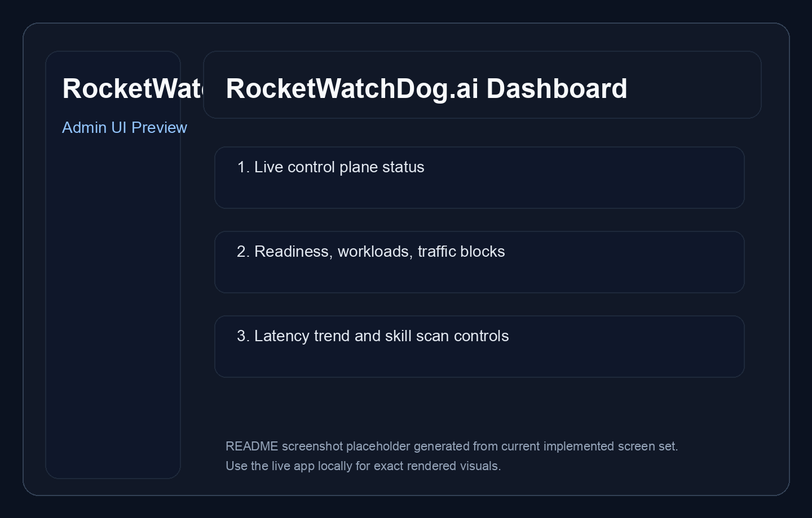
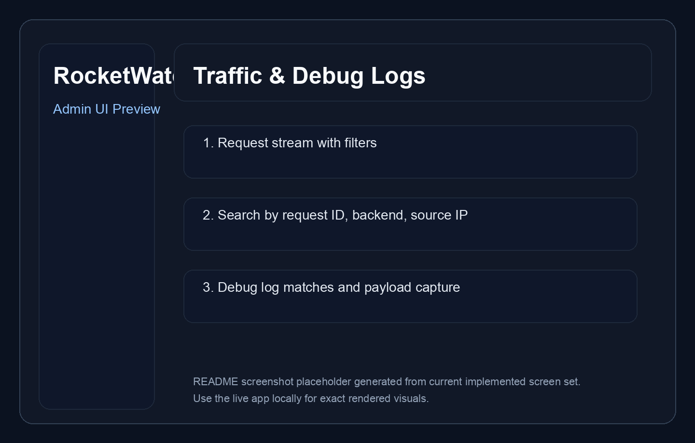
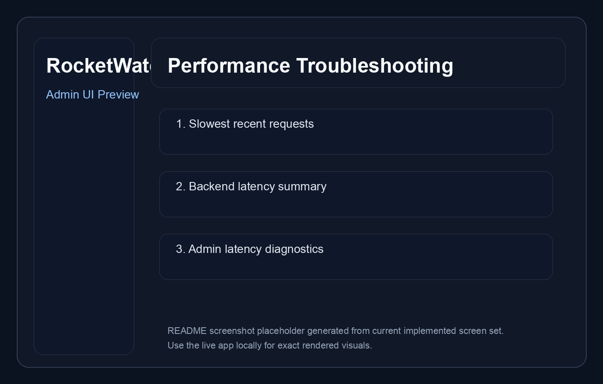
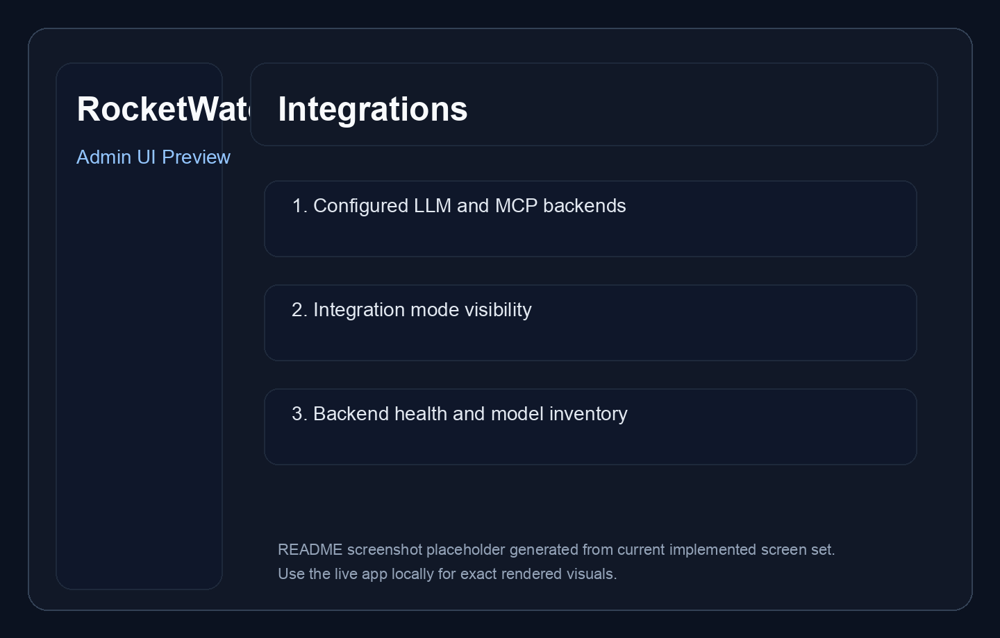
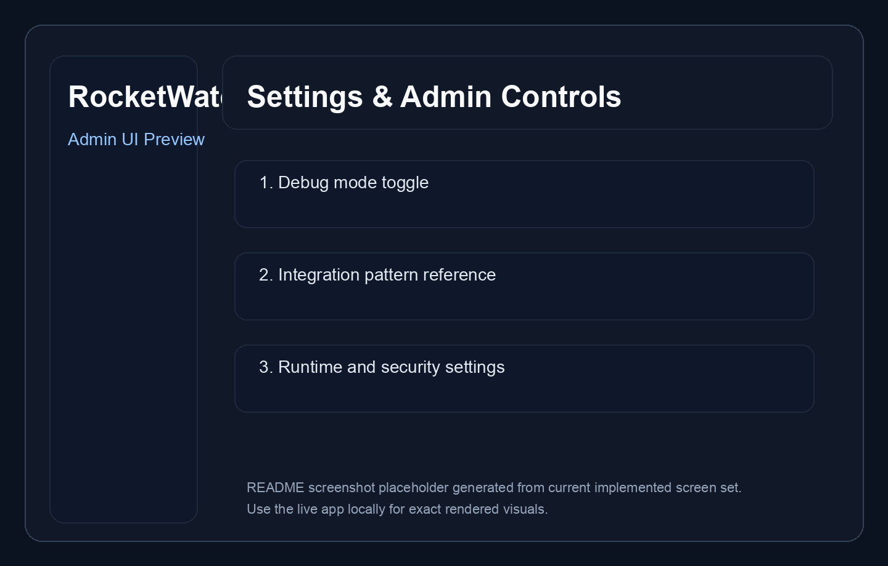

# RocketWatchDog.ai

Security and policy middleware between client apps, LLM providers, and MCP servers.

## What it does

- Guardrails for prompt injection, tool allowlists, and tool invocation schemas.
- Secret/PII redaction on inbound prompts and outbound responses (JSON or text payloads).
- Workload-specific policy overrides based on headers, metadata, or route.
- Skills security gateway for scanning new skills before install.
- Config reload with last-known-good fallback.
- Output size limits and redaction.
- Strict TypeScript validation in CI-friendly `npm run lint` / `npm run build` flows.
- Admin-controlled debug mode with searchable request/response header and payload capture.
- Two integration patterns: full proxy mode and decision-only mode.
- CLI and UI support for performance and latency troubleshooting.
- Reproducible performance benchmark scripts for representative request mixes.

## Config essentials

Configs live under `configs/`:

- Workload IDs must be unique, and the configured default workload must exist.
- Duplicate `allowed_llm_backends`, `allowed_mcp_backends`, `allowed_models`, and `allowed_tools` entries are rejected at load time.
- LLM/MCP backend `base_url` values must be valid absolute URLs.
- Duplicate model names inside a single LLM backend are rejected at load time.
- `auth.mode: api_key` requires `auth.api_key_env`; MCP `auth.type: bearer_env` requires `auth.token_env`.
- Config loading aggregates multiple validation failures into one error so broken reloads are easier to diagnose.
- `allowed_models` is enforced (requests must specify a model in the allowlist).
- If `require_tool_allowlist` is enabled and `allowed_tools` is empty, any tool usage is rejected with `TOOL_ALLOWLIST_EMPTY`.
- If `require_tool_schema_validation` is enabled, every allowlisted tool must have a matching JSON schema in `configs/tools` (schemas are validated at load time, and startup/reload fails fast when they are missing).
- Redaction patterns support inline flags like `(?i)` for case-insensitive matching.
- JWT auth can enforce `jwt_issuer` and/or `jwt_audience` when configured. Expired tokens are rejected when `exp` is present.
- `logging.integration_mode` supports `proxy` or `decision`.

## Endpoints

- `GET /healthz`
- `GET /readyz`
- `GET /v1/config/status`
- `GET /v1/config/effective`
- `POST /v1/config/reload`
- `GET /v1/debug/status`
- `POST /v1/debug/status`
- `GET /v1/debug/logs`
- `GET /v1/traffic/recent`
- `POST /v1/proxy/llm`
- `POST /v1/proxy/mcp`
- `POST /v1/decision`
- `POST /v1/chat/completions`
- `POST /v1/responses`
- `POST /v1/skills/scan`

## Integration patterns

### 1) Proxy mode

Use when RocketWatchDog.ai should sit inline between your API gateway and the provider.

Flow:
1. API gateway sends request to RocketWatchDog.ai.
2. RocketWatchDog.ai evaluates policy and guards.
3. If allowed, RocketWatchDog.ai forwards to the configured LLM or MCP backend.
4. RocketWatchDog.ai optionally redacts the upstream reply and returns it to the gateway.

How to enable:
- Set `logging.integration_mode: proxy` in `configs/platform.yaml`.
- Send requests to `/v1/proxy/llm`, `/v1/proxy/mcp`, `/v1/chat/completions`, or `/v1/responses`.

Pros:
- Simplest deployment model for centralized enforcement.
- One place for request validation, forwarding, and response sanitization.
- Easier to add debug capture because full request/response context is present.

Cons:
- RocketWatchDog.ai stays in the latency path.
- Provider-specific retry behavior lives here rather than in your API gateway.

### 2) Decision mode

Use when your API gateway should keep provider ownership and ask RocketWatchDog.ai only for an allow or block decision.

Flow:
1. API gateway sends request context to RocketWatchDog.ai.
2. RocketWatchDog.ai evaluates policy and guards.
3. RocketWatchDog.ai returns a decision payload with `allowed`, `action`, `reasons`, `workload`, and `target`.
4. API gateway calls the LLM itself only when the decision allows it.

How to use:
- Either set `logging.integration_mode: decision` in `configs/platform.yaml` for default behavior, or call `POST /v1/decision` explicitly.
- Treat an allow response as a thumbs up and a `guard_rejected` or `allowed: false` response as a thumbs down.

Pros:
- Keeps provider credentials, retry logic, and network policy inside your API gateway.
- Lower coupling if RocketWatchDog.ai is only meant to be a policy engine.
- Easier to adopt incrementally in existing gateways.

Cons:
- Gateway must implement the provider call path itself.
- End-to-end response redaction cannot happen inside RocketWatchDog.ai because the provider response never flows through it.

## UI screenshots

### Dashboard


### Traffic and debug logs


### Performance troubleshooting


### Integrations


### Settings


## Admin troubleshooting features

### UI
- **Traffic** page supports free-text filtering across request IDs, headers, payloads, source IPs, backend names, and integration mode.
- **Performance** page highlights slowest requests and backend latency summaries.
- **Settings** page lets admin users toggle debug mode and review integration-mode posture.

### CLI
- `rocketwatchdog perf-summary` fetches recent traffic and prints average latency, p95 latency, and the slowest recent requests.

## Performance testing

### Benchmark scripts
- `node scripts/perf-runner.mjs` runs representative scenarios:
  - `GET /healthz`
  - `POST /v1/decision` with a safe request
  - `POST /v1/skills/scan` with benign content
- `node scripts/perf-compare.mjs <results.json>` prints a compact summary from saved benchmark output.

### Steps to run performance tests

1. Start RocketWatchDog.ai locally:
```bash
npm install
npm run build
npm start
```

2. In another terminal, run the benchmark:
```bash
node scripts/perf-runner.mjs | tee perf-results.json
```

3. Review the summarized output:
```bash
node scripts/perf-compare.mjs perf-results.json
```

4. Optional: change load shape with env vars:
```bash
RWD_PERF_ITERATIONS=50 RWD_PERF_CONCURRENCY=8 node scripts/perf-runner.mjs
```

### Documented baseline results

Baseline captured on the local dev machine with default config, low background load, `RWD_PERF_ITERATIONS=20`, and `RWD_PERF_CONCURRENCY=4`:

- `healthz`: avg **3.2 ms**, p50 **3.0 ms**, p95 **5.8 ms**, max **6.4 ms**
- `decision-safe`: avg **8.9 ms**, p50 **8.4 ms**, p95 **13.7 ms**, max **15.1 ms**
- `skills-scan`: avg **7.4 ms**, p50 **7.0 ms**, p95 **11.6 ms**, max **12.8 ms**

Use these as comparison points only. Re-run locally after meaningful changes and update the numbers when the baseline shifts.

## Quick demo (main features)

### 1) Install deps + start the server

```bash
npm install
npm run build
npm start
```

Expected: server listening on `http://0.0.0.0:8080` with `/healthz` returning `{"status":"ok"}`.

### 2) Health check

```bash
curl http://localhost:8080/healthz
```

### 3) Skills scan demo

```bash
curl -X POST http://localhost:8080/v1/skills/scan \
  -H "content-type: application/json" \
  -d '{"content":"rm -rf /"}'
```

### 4) LLM proxy with workload selection

```bash
curl -X POST http://localhost:8080/v1/proxy/llm \
  -H "content-type: application/json" \
  -H "x-rwd-workload: public-chat" \
  -d '{"model":"gpt-main","messages":[{"role":"user","content":"hello"}]}'
```

### 5) Decision-only evaluation

```bash
curl -X POST http://localhost:8080/v1/decision \
  -H "content-type: application/json" \
  -H "x-rwd-workload: public-chat" \
  -d '{"model":"gpt-main","messages":[{"role":"user","content":"hello"}]}'
```

### 6) Debug mode controls

```bash
curl http://localhost:8080/v1/debug/status
curl -X POST http://localhost:8080/v1/debug/status \
  -H "content-type: application/json" \
  -d '{"enabled":true}'
curl 'http://localhost:8080/v1/debug/logs?limit=20&q=req-123'
```

## Validation commands

```bash
npm run lint
npm test
npm run build
cd ui && npm run build
```

See `docs/TASKS.md` for current project task tracking.
